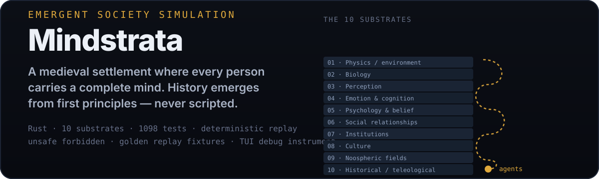

# Mindstrata

<p align="center">
  
</p>

> **A deterministic, emergent human-society simulation** — a small medieval settlement where every person carries a full psychological mind, biological needs, social relationships, moral values, and institutional memberships. History emerges from first principles, not scripted events.

[](https://github.com/ishan-parihar/mindstrata/actions)
[](https://www.rust-lang.org)
[](#)
[](LICENSE)

---

## Why Mindstrata

Most agent simulations are narrative: if `stress > 0.8` then `spawn_revolting()`. Mindstrata simulates the **causes** — need pressure, emotional appraisal, trust erosion, resource scarcity — and lets outcomes **emerge**.

Agents are bounded: each knows only its body, needs, emotions, memories, local perception, and rumors. That bounded knowledge is what makes misinformation, gossip, panic, and institutional failure possible.

## What Mindstrata Is

Most simulations script outcomes: `if unrest > 0.8 { spawn_revolt() }`. Mindstrata instead simulates the **causes** — need pressure, emotional appraisal, trust erosion, resource scarcity, institutional legitimacy, social influence, rumor propagation — and lets revolt (or recovery) *emerge*.

Agents are not omniscient. Each knows only its body, needs, emotions, memories, relationships, local perception, institutional memberships, rumors it has heard, and beliefs that **may be false**. That bounded knowledge is what makes misinformation, gossip, panic, prejudice, and institutional failure possible at all.

**Core properties:**

- **Emergent history** — outcomes arise from locally bounded minds and material constraints, never global variables
- **Deterministic replay** — byte-identical runs from `seed + scenario + input log`; emergent behavior is debugger-accessible
- **Full cognitive pipeline per agent** — needs → emotions → appraisal → decisions → social consequences, across 60+ simulation modules
- **Simulation-first, GUI-later** — the TUI is a debug instrument; the simulation runs headless

The design sits between **The Sims** (individual psychology), **Cities: Skylines** (settlements/economy), and **Dwarf Fortress** (deep emergence) — with the differentiator that *every* agent has a complete cognitive pipeline.

The substrate architecture is documented in [`docs/architecture/AP2.md`](docs/architecture/AP2.md); live state and remaining work in [`docs/MINDSTRATA_CURRENT_STATE.md`](docs/MINDSTRATA_CURRENT_STATE.md) and [`docs/REMAINING_WORK_REPORT.md`](docs/REMAINING_WORK_REPORT.md).

## Quick Start

```bash
cargo run --release -- --seed 42 --ticks 10000
```

The mystery simulation runs headless. For the inspector and metrics tooling, build the CLI crate:

```bash
cargo build --release -p mindstrata-cli
cargo build --release -p mindstrata-tui
```

## Features

| Area | What's simulated |
|------|------------------|
| **Biology** | Needs, health, hunger, fatigue, vitality, lifespan |
| **Psychology** | Emotions, appraisal, personality, belief (with false-belief propagation) |
| **Social** | Relationships, trust, gossip, rumor, reputation, prejudice |
| **Economics** | Scarcity, exchange, labor, property, inequality feedback |
| **Institutions** | Legitimacy, membership, governance, institutional failure |
| **Ecology & demography** | Population dynamics, resources, migration |
| **Conflict & culture** | Emergent factionalism, norms, cultural memory |
| **Noospheric fields** | Collective/intangible dynamics over the population |

## Architecture — The 10 Substrates

The simulation is layered as ten substrates (see `docs/architecture/AP2.md`), each building on the one below:

1. **Physics / environment** — the settlement's material basis
2. **Biology** — bodies, needs, health
3. **Perception** — bounded local awareness
4. **Emotion & cognition** — appraisal pipeline
5. **Psychology & belief** — personality, memory, potentially-false beliefs
6. **Social relationships** — dyadic and group bonds
7. **Institutions** — formal structures and their legitimacy
8. **Culture** — shared norms and memes
9. **Noospheric fields** — collective phenomena
10. **Historical/teleological layer** — trajectory and meaning over time

## Workspace Layout

```
mindstrata/
├── crates/
│   ├── mindstrata-core     # simulation substrate implementations
│   ├── mindstrata-sim      # orchestration & determinism harness
│   ├── mindstrata-cli      # headless runner, agent inspector, CSV metrics
│   ├── mindstrata-tui      # TUI debug instrument
│   ├── mindstrata-tests    # golden replays, property & emergence tests
│   └── mindstrata-benches  # criterion regression harness
├── docs/
│   ├── architecture/       # AP2.md — the substrate architecture
│   ├── MINDSTRATA_CURRENT_STATE.md
│   └── REMAINING_WORK_REPORT.md
├── specs/                  # data-driven specifications (RON)
├── golden/  golden-runs/   # deterministic replay fixtures & recorded runs
└── tasks/
```

## Testing & Determinism

- **1098 automated tests** — property tests, golden replay fixtures, statistical emergence checks, integration, and 10K-tick stability (count re-derived from the current suite)
- Tick-loop throughput regression gate enforced in CI (`crates/mindstrata-benches`)
- `unsafe_code = "forbid"` workspace-wide — the simulation must be memory-safe and deterministic

```bash
cargo test --workspace
cargo bench -p mindstrata-benches --no-run
```

## License

MIT. See `LICENSE`.